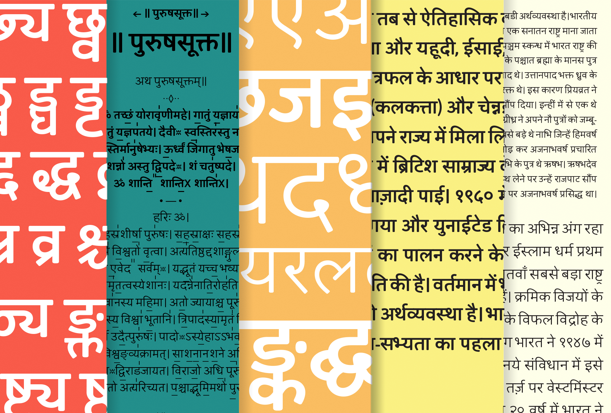

Jaldi [Asap-Devanagari]
===============
**Omnibus-Type**  
*SIL Open Font License, 1.1*

Jaldi, the Devanagari typeface based in Asap.

# Jaldi family

Jaldi is the hindi for soon. Formerly Asap Devanagari, Jaldi is a contemporary sans-serif non-modular devanagari family with subtle rounded corners. Designed by Nicolas Silva and Pablo Cosgaya, Jaldi is being developed in order to match with the former design of Asap Family ("as soon as possible") there are 2 styles: Regular and Bold. This family, is being specially developed for screen as webfont and desktop font too; Jaldi offers a standardised character width on all styles, which means that its lines of text remain the same length. This useful feature allows users to change type styles on-the-go without reflowing a text body. The latin version of Asap is based on Ancha (designed by Pablo Cosgaya & Hector Gatti), how was developed with the collaboration of Andres Torresi and Nicolas Silva.

####Jaldi Family contains:
* regular
* bold

To contribute to the project contact [Omnibus-Type](http://omnibus-type.com/).

### Designers

* Pablo Cosgaya
* Nicolas Silva

### License

Copyright (c) 2011-2015, Omnibus-Type (www.omnibus-type.com omnibus.type@gmail.com)

Licensed under the [*SIL Open Font License, 1.1*](http://scripts.sil.org/OFL); you may not use this file except in compliance with the License.

======
## FONTLOG for the Jaldi fonts

This file provides detailed information on the Jaldi font software.  
This information should be distributed along with the Jaldi fonts and any derivative works.

### Jaldi is a typeface family that supports Unicode language range: 

* Devanagari            U+0900-U+097F (128/128)
* Devanagari Extended   U+A8E0-U+A8FF (28/28)
* Vedic Extension       U+1CD0-U+1CFF (4/39)
* Basic Latin 				  U+0020-U+007E
* Latin-1 Supplement 		U+00A0-U+00FF
* Latin Extended-A 			U+0100-U+017F
* Latin Extended Additional	U+1E00-U+1EFF (111/256)

**Character map to support MS Codepages:**
* 1252 Latin-1
* 1250 Latin-2 (Easter Europe)
* 1254 Turkish
* 1257 Windows Baltic
* 1258 Vietnamese
* Mac Roman

*To contribute to the project contact Omnibus-Type at omnibus.type@gmail.com*

**27 January 2015 (Jaldi v.1.1) Omnibus-Type**
- Removed Reserve Font Name from the license
- fsType Installable mode

**14 Jan 2015 (Jaldi v.1.1) Omnibus-Type**
- Several changes in the proportion of the letters (Thanks Vaishnavi).
- Enhance halfform conections with other consonants.
- Added halfforms variants for Ka, Pha and others.
- Scaled glyphs in order to stay insie 1k UPM

**14 Nov 2014 (Jaldi v.1.0) Omnibus-Type**
- First complete released of Jaldi (previously Asap Devanagari)

**11 Nov 2014 (Jaldi v.0.9) Omnibus-Type**
- Released beta version of Jaldi (previously Asap Devanagari)

**22 Sep 2014 (v.1.5) Omnibus-Type**
- Starting with the development of the Devanagari version

**1 Oct 2013 (v.1.5) Omnibus-Type**
- Expanded in order to support Adobe Latin 3 and vietnamite
- Updating hinting with ttfautohint (v0.97)
- Increased vertical metrics
- Improved CFF hint (AFDK 2.5.59)
- Improved TTF hint (TTFAutohint 0.95)
- Fixed TTF table names
- Updated and expanded features in OT Tables:
  - GSUB:
    * **aalt** Access All Alternatives
    * **ccmp** Glyph Composition/Decomposition
    * **locl** Localized Forms
    * **sups** SuperScript
    * **frac** Diagonal Fractions
    * **ordn** Ordinals
    * **liga** Standar Ligatures
    * **ss01** Style Set 1
    * **salt** Stylistic Alternatives
      * Single Substitution
      * Ligature Substitution
  - GPOS:
    * **mark** Mark Positioning
    * **mkmk** Mark to Mark
    * **cpsp** Capital Spacing

**19 Jan 2012 (v.1.001) Omnibus-Type**
- Initial release

### Acknowledgements

If you make modifications be sure to add your name (N), email (E), web-address
(if you have one) (W) and description (D). This list is in alphabetical order.

**N:** **Andres Torresi**  
**E:** omnibus.type@gmail.com  
**W:** http://www.omnibus-type.com  
**D:** Assistant designer of Asap family  

**N:** **Hector Gatti**  
**E:** omnibus.type@gmail.com  
**W:** http://www.omnibus-type.com  
**D:** Designer of Ancha upstream  

**N:** **Nicolas Silva**  
**E:** omnibus.type@gmail.com  
**W:** http://www.omnibus-type.com  
**D:** Typeface developer and designer of the Devanagari version

**N:** **Pablo Cosgaya**  
**E:** omnibus.type@gmail.com  
**W:** http://www.omnibus-type.com  
**D:** Original designer Archivo Narrow
